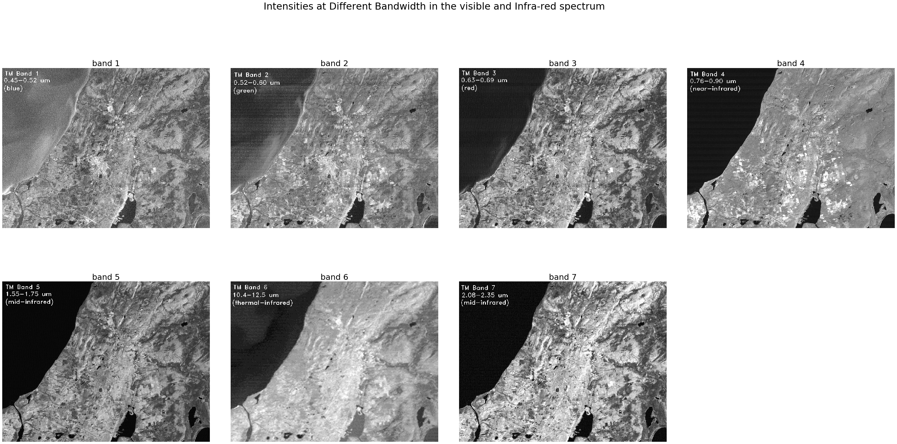
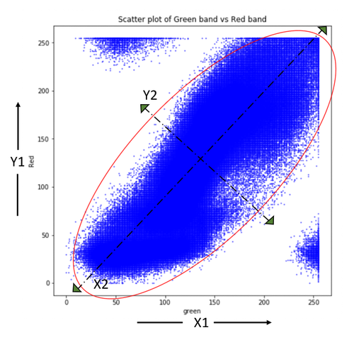
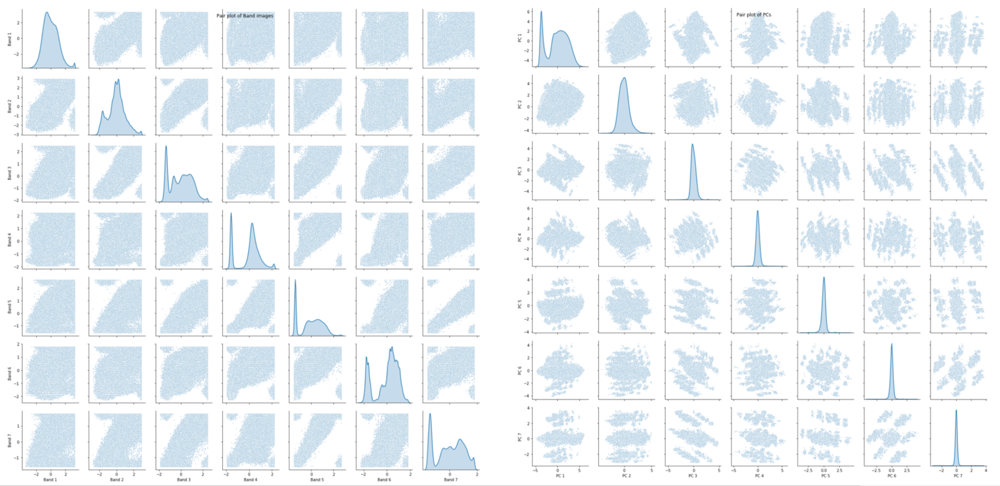
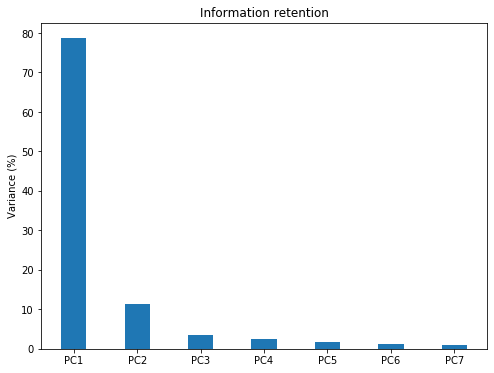
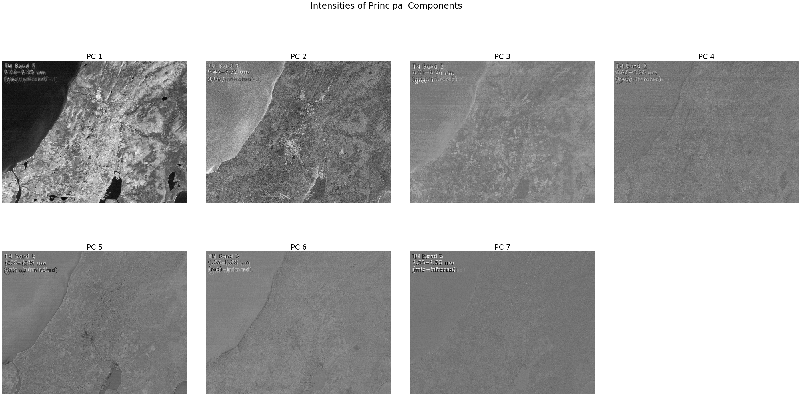

# Principal Component Analysis: In-depth understanding through image visualization

Principal Component Analysis (PCA) is a popular dimensionality reduction technique used in Machine Learning applications. PCA condenses information from a large set of variables into fewer variables by applying some sort of transformation onto them. The transformation is applied in such a way that linearly correlated variables get transformed into uncorrelated variables. Correlation tells us that there is redundancy of information and if this redundancy can be reduced, then information can be compressed. For example, if there are two variables in the variable set which are highly correlated, then, we are not gaining any extra information by retaining both the variables because one can be nearly expressed as the linear combination of the other. In such cases, PCA transfers the variance of the second variable onto the first variable by translation and rotation of original axes and projecting data onto new axes. The direction of projection is determined using eigenvalues and eigenvectors. So, the first few transformed features (termed as Principal Components) are rich in information, whereas the last features contain mostly noise with negligible information in them. This transferability allows us to retain the first few principal components, thus reducing the number of variables significantly with minimal loss of information.

This article focuses more on practical step-by-step PCA implementation on Image data rather than a theoretical explanation as there are tons of materials already available for that. The image data has been chosen over tabular data so that the reader can better understand the working of PCA through image visualization. Technically, an image is a matrix of pixels whose brightness represents the reflectance of surface feature within that pixel. The reflectance value ranges from 0 to 255 for an 8-bit integer image. So the pixels with zero reflectance would appear as black, pixels with value 255 appear as pure white and pixels with value in-between appear in a gray tone. Landsat TM satellite Images, captured over the coastal region of India, have been used in this tutorial. The images are resized to a smaller scale to reduce computational load on the CPU. The image set consists of 7 band images captured across the blue, green, red, near-infrared (NIR) and mid-infrared (MIR) range of the electromagnetic spectrum. For readers who are interested in trying out steps on their own, kindly refer to this Github repository that contains Input datasets and the Ipython code used here. Let’s get started without further ado.

##  Loading modules and Image data

The first step is to import the required libraries and load data. To make accessibility and processing easier, the band images are stacked in a 3d numpy array of sizes 850 x 1100 x 7 (height x width x no of bands). The color image shown below is a composite of Red, Green, and Blue (RGB) band images, reproducing the same view as it would have appeared to us. Get a glimpse of the scene.


```python
from IPython.display import Image, display
import matplotlib.pyplot as plt
import pandas as pd
import seaborn as sns
import cv2
import numpy as np
# Read RGB image into an array
img = cv2.imread('band321.jpg')
img_shape = img.shape[:2]
print('image size = ',img_shape)
# specify no of bands in the image
n_bands = 7
# 3 dimensional dummy array with zeros
MB_img = np.zeros((img_shape[0],img_shape[1],n_bands))
# stacking up images into the array
for i in range(n_bands):
    MB_img[:,:,i] = cv2.imread('band'+str(i+1)+'.jpg',
                               cv2.IMREAD_GRAYSCALE)  
# Let's take a look at scene
print('\n\nDispalying colour image of the scene')
plt.figure(figsize=(img_shape[0]/100,img_shape[1]/100))
plt.imshow(img, vmin=0, vmax=255)
plt.axis('off');
```


The image scene encompasses various surface features such as water, built-up area, forest, and farmland.

## Data Exploration
Let us take a look at the reflectances of individual band images for different features and try to get some insight into the features in the band images.

``` python
import matplotlib.pyplot as plt
import matplotlib.gridspec as grid

fig,axes = plt.subplots(2,4,figsize=(50,23),sharex='all', sharey='all')
fig.subplots_adjust(wspace=0.1, hspace=0.15)
fig.suptitle('Intensities at Different Bandwidth in the visible and Infra-red spectrum', fontsize=30)
axes = axes.ravel()

for i in range(n_bands):
    axes[i].imshow(MB_img[:,:,i],cmap='gray', vmin=0, vmax=255)
    axes[i].set_title('band '+str(i+1),fontsize=25)
    axes[i].axis('off')
fig.delaxes(axes[-1])
```



If we observe the images, all bands have captured one or more surface features and also each feature is captured well in multiple bands. For example, farmlands are easily distinguishable from other surface features in both band 2 (green) and band 4 (near-infrared) image but not in others. So, there exists redundancy of information between the bands which means reflectances are somewhat correlated across bands. This gives us the right opportunity to test PCA on them.

## Data Standardization
Before applying PCA, we have to bring our data to a common format through standardization. The purpose of doing this is to make sure that variables are internally consistent with each other regardless of their type. For example, if a dataset has two variables temperature measured in degrees Celsius and rainfall measured in cm. Since the variables range and units are different, it is not advisable to use dissimilar variables as they are, otherwise, variables differing in order of magnitude may introduce a model bias towards some variables. Standardization is done by centering the variable by subtracting mean and then bringing them to a common scale by dividing standard deviation. Since the variables (band images) we are dealing with are similar and have the same range, standardization is not necessary but still, it is a good practice to apply.

Our variables which are image 2-d arrays need to be converted to 1-d vector to facilitate Matrix computation. Let’s create a variable matrix of size 935000 X 7 (number of pixels in image X number of bands) and store these 1-d vectors in it.

``` python
# Convert 2d band array in 1-d to make them as feature vectors and Standardization
MB_matrix = np.zeros((MB_img[:,:,0].size,n_bands))
for i in range(n_bands):
    MB_array = MB_img[:,:,i].flatten()  # covert 2d to 1d array 
    MB_arrayStd = (MB_array - MB_array.mean())/MB_array.std()  
    MB_matrix[:,i] = MB_arrayStd
MB_matrix.shape;
```
##  PCA Transformation

Let us understand a little bit more about the axis transformation that happens within the PCA. The scatter plot below shows the correlation between green and red band data. Principal component axes (X2, Y2) are then determined using eigenvectors such that variance is maximum along the X2 direction and the direction orthogonal to it gives Y2 with minimum variance. The original axes (X1, Y1) are now rotated along principal component axes (X2, Y2) and the data projected on these new axes are Principal Components. It is important to note that correlations existing in original data are eliminated after transformation onto (X2, Y2) space whereas variance is partially transferred from one variable to another.




## Eigenvalues and Vectors Computation

The next step is to compute the eigenvectors and corresponding eigenvalues of the covariance matrix

``` python
# Covariance
np.set_printoptions(precision=3)
cov = np.cov(MB_matrix.transpose())

# Eigen Values
EigVal,EigVec = np.linalg.eig(cov)
print("Eigenvalues:\n\n", EigVal,"\n")
```
*Eigenvalues:
[5.508 0.796 0.249 0.167 0.088 0.064 0.128]*

In this step, data compression and dimensionality reduction come into the picture. If you look at eigenvalues you will notice that values are quite different. These values give us the order of significance of eigenvectors or directions i.e axis along eigenvector with the largest eigenvalue is the most significant PC axis and so on. The next step is to order eigenvectors by their eigenvalue, highest to lowest, to rearrange principal components in order of significance. We need to transform the data in the direction of ordered eigenvectors which in turn results in principal components.

``` python
# Ordering Eigen values and vectors
order = EigVal.argsort()[::-1]
EigVal = EigVal[order]
EigVec = EigVec[:,order]

#Projecting data on Eigen vector directions resulting to Principal Components 
PC = np.matmul(MB_matrix,EigVec)   #cross product
```

## Validation of Principal Components
### Dependency Check

We were able to produce principal components successfully. Now, Let’s validate the PCs to check whether they were able to reduce redundancy and also check the extent to which data compression was achieved. we will create scatter plots to visualize the pairwise relationship in the original bands and compare the same with the pairwise relationship of PCs to test for the existence of dependency.
``` python
# Generate Paiplot for original data and transformed PCs

Bandnames = ['Band 1','Band 2','Band 3','Band 4','Band 5','Band 6','Band 7']
a = sns.pairplot(pd.DataFrame(MB_matrix,
                columns = Bandnames),
                 diag_kind='kde',plot_kws={"s": 3})

a.fig.suptitle("Pair plot of Band images")

PCnames = ['PC 1','PC 2','PC 3','PC 4','PC 5','PC 6','PC 7']
b = sns.pairplot(pd.DataFrame(PC,
                columns = PCnames),
                 diag_kind='kde',plot_kws={"s": 3})

b.fig.suptitle("Pair plot of PCs")
```



*Pair plot of Bands (left) and PCs (right)*

Let’s take a look at the pair plots and notice that correlation between the variables which exist in the original data has disappeared in the principal components. So, the PCA was able to reduce correlation significantly. The distribution plots along the diagonal tell us that PCA was also successful in transferring variance which is associated with compressibility.

### Compressibility Check

``` python
#Information Retained by Principal Components

plt.figure(figsize=(8,6))
plt.bar([1,2,3,4,5,6,7],EigVal/sum(EigVal)*100,align='center',width=0.4,
        tick_label = ['PC1','PC2','PC3','PC4','PC5','PC6','PC7'])
plt.ylabel('Variance (%)')
plt.title('Information retention');
```


The Bar plot of Eigenvalues expressed in percentage plotted above gives us the information retained in each PC. Notice that the last PCs eigenvalues are small and less significant, this is where dimensionality reduction comes into play. If we choose to keep the first three relevant components that retain 93% information then the final data can be reduced from 7 dimensions to 3 without losing much information.

## Converting PCs back to Images

It’s time to reshape 1-d PCs back to the original image shape and normalize PCs between 0 and 255 which is the same as the original image range to make image visualization possible.

``` python
# Rearranging 1-d arrays to 2-d arrays of image size
PC_2d = np.zeros((img_shape[0],img_shape[1],n_bands))

for i in range(n_bands):
    PC_2d[:,:,i] = PC[:,i].reshape(-1,img_shape[1])

# normalizing between 0 to 255
PC_2d_Norm = np.zeros((img_shape[0],img_shape[1],n_bands))

for i in range(n_bands):
    PC_2d_Norm[:,:,i] = cv2.normalize(PC_2d[:,:,i],
                    np.zeros(img_shape),0,255 ,cv2.NORM_MINMAX)
```

Let’s determine the amount of compression visually.

``` python
fig,axes = plt.subplots(2,4,figsize=(50,23),sharex='all',
                        sharey='all')
fig.subplots_adjust(wspace=0.1, hspace=0.15)
fig.suptitle('Intensities of Principal Components ', fontsize=30)
axes = axes.ravel()

for i in range(n_bands):
    axes[i].imshow(PC_2d_Norm[:,:,i],cmap='gray', vmin=0, vmax=255)
    axes[i].set_title('PC '+str(i+1),fontsize=25)
    axes[i].axis('off')
fig.delaxes(axes[-1])
```



*Intensities of Principal Components images*

Notice that the first few PCs have rich information and are clear, and as we move towards the end, the PCs start losing information with last PCs mostly containing noise. We will retain the first three PCs and discard the rest. This will be useful in improving data quality by removing noise and also processing by machine learning algorithms efficient in terms of time and memory usage.

## PC and RCB Image Comparision

``` python
# Comparsion of RGB and Image produced using first three bands
fig,axes = plt.subplots(1,2,figsize=(50,23),
                        sharex='all', sharey='all')   
fig.subplots_adjust(wspace=0.1, hspace=0.15)

axes[0].imshow(MB_img[:,:,0:3].astype(int))
axes[0].axis(‘off’);
axes[1].imshow(PC_2d_Norm[:,:,:3][:,:,[0,2,1]].astype(int))
axes[1].axis(‘off’);
```


*Comparison of RGB image (left) and principal components composite image (right)*

Finally, we reproduced the same scene using the first three Principal components. The image on the left appears more colorful than the original image RGB which makes the features in the scene appear more clear and distinguishable from each other. Some features also appear to be more prominent in PC images that are difficult to identify in the left image. So, it can be concluded that the PCA has done a great job on our Image data in terms of compressibility and information retention.
